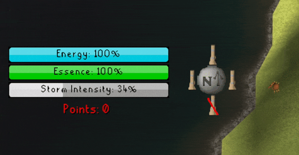

# Interface Tweaker

> A highly customizable plugin enabling you to change the opacity of almost any interface element (or hide it
> completely).

Are big interfaces taking up too much space on your screen? Here's a solution!

In the plugin's side panel, you can hover over the names of the interfaces and they'll be highlighted on screen. Right
click on the name to set opacity or hide. Only interfaces which are currently visible are listed.

By default, the plugin's side panel only shows the interfaces which are named by this plugin. If the interface you are
looking for isn't named yet, feel free to turn on the plugin settings to show unlabeled interfaces, you can then set
your own labels. Please contribute to this plugin with more named interfaces if they are broadly useful!

Note: Most interfaces can be hidden, but some cannot be properly made transparent. Not much that can be done there
unfortunately. Some highly problematic interfaces will even re-show themselves so cannot be hidden. I recommend playing
around with it and see what works for you.